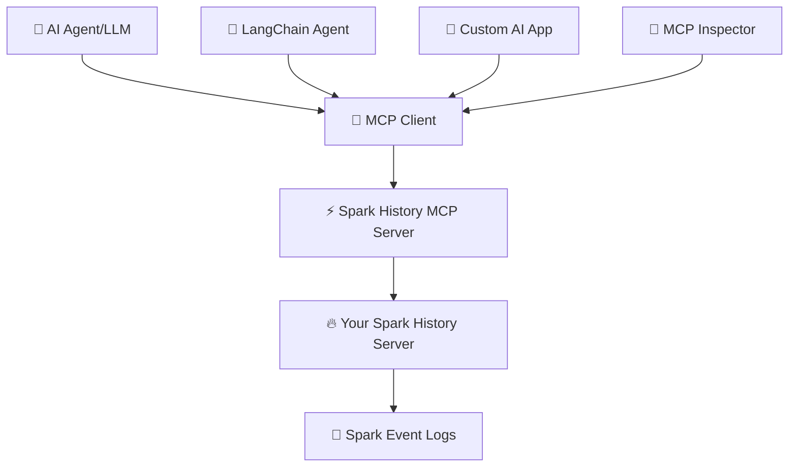

# 🔥 Spark History Server MCP

[](https://github.com/DeepDiagnostix-AI/spark-history-server-mcp/actions)
[](https://www.python.org/downloads/)
[](https://modelcontextprotocol.io/)
[](https://opensource.org/licenses/Apache-2.0)

> **🤖 Connect AI agents to Apache Spark History Server for intelligent job analysis and performance monitoring**

Transform your Spark infrastructure monitoring with AI! This Model Context Protocol (MCP) server enables AI agents to analyze job performance, identify bottlenecks, and provide intelligent insights from your Spark History Server data.

## 🎯 What is This?

**Spark History Server MCP** bridges AI agents with your existing Apache Spark infrastructure, enabling:

- 🔍 **Query job details** through natural language
- 📊 **Analyze performance metrics** across applications
- 🔄 **Compare multiple jobs** to identify regressions
- 🚨 **Investigate failures** with detailed error analysis
- 📈 **Generate insights** from historical execution data

## 🏗️ Architecture



**🔗 Components:**
- **🔥 Spark History Server**: Your existing infrastructure serving Spark event data
- **⚡ MCP Server**: This project - provides MCP tools for querying Spark data
- **🤖 AI Agents**: LangChain, custom agents, or any MCP-compatible client

## ⚡ Quick Start

### 📋 Prerequisites
- 🔥 Existing Spark History Server (running and accessible)
- 🐍 Python 3.12+
- ⚡ [uv](https://docs.astral.sh/uv/getting-started/installation/) package manager

### 🚀 Setup
```bash
git clone https://github.com/DeepDiagnostix-AI/spark-history-server-mcp.git
cd spark-history-server-mcp
uv sync
```

### ⚙️ Configuration
Edit `config.yaml`:
```yaml
servers:
  default:
    url: "http://your-spark-history-server:18080"
    auth:  # optional
      username: "user"
      password: "pass"
```

### 🔬 Testing with MCP Inspector
```bash
# Start MCP server with Inspector (opens browser automatically)
npx @modelcontextprotocol/inspector uv run main.py
```

**🌐 Test in Browser** - The MCP Inspector opens at http://localhost:6274 for interactive tool testing!

## 📸 Screenshots

### 🔍 Get Spark Application


### ⚡ Job Performance Comparison

*Compare performance metrics between different Spark jobs*


## 🛠️ Available Tools

| 🔧 Tool | 📝 Description |
|---------|----------------|
| `list_applications` | 📋 List Spark applications with filtering |
| `get_application_details` | 📊 Get comprehensive application info |
| `get_application_jobs` | 🔗 List jobs within an application |
| `get_job_details` | 🔍 Get detailed job information |
| `get_stage_details` | ⚡ Analyze stage-level metrics |
| `get_task_details` | 🎯 Examine individual task performance |
| `get_executor_summary` | 🖥️ Review executor utilization |
| `compare_job_performance` | 📈 Compare multiple jobs |
| `get_application_environment` | ⚙️ Review Spark configuration |
| `get_storage_info` | 💾 Analyze RDD storage usage |
| `get_sql_execution_details` | 🔎 Deep dive into SQL queries |

## 🚀 Production Deployment

Deploy using Kubernetes with Helm:

> ⚠️ **Work in Progress**: We are still testing and will soon publish the container image and Helm registry to GitHub for easy deployment.

```bash
# 📦 Deploy with Helm
helm install spark-history-mcp ./deploy/kubernetes/helm/spark-history-mcp/

# 🎯 Production configuration
helm install spark-history-mcp ./deploy/kubernetes/helm/spark-history-mcp/ \
  --set replicaCount=3 \
  --set autoscaling.enabled=true \
  --set monitoring.enabled=true
```

📚 See [`deploy/kubernetes/helm/`](deploy/kubernetes/helm/) for complete deployment manifests and configuration options.

## 🧪 Testing & Development

### 🔬 Local Development
```bash
# 🔥 Start local Spark History Server with sample data
./start_local_spark_history.sh

# ⚡ Start MCP server
uv run main.py

# 🌐 Test with MCP Inspector
npx @modelcontextprotocol/inspector uv run main.py
```

### 📊 Sample Data
The repository includes real Spark event logs for testing:
- `spark-bcec39f6201b42b9925124595baad260` - ✅ Successful ETL job
- `spark-110be3a8424d4a2789cb88134418217b` - 🔄 Data processing job
- `spark-cc4d115f011443d787f03a71a476a745` - 📈 Multi-stage analytics job

📖 **Complete testing guide**: **[TESTING.md](TESTING.md)**

## ⚙️ Configuration

### 🌐 Multi-server Setup
```yaml
servers:
  production:
    default: true
    url: "http://prod-spark-history:18080"
    auth:
      username: "user"
      password: "pass"
  staging:
    url: "http://staging-spark-history:18080"
```

### 🔐 Environment Variables
```bash
SPARK_USERNAME=your_username
SPARK_PASSWORD=your_password
SPARK_TOKEN=your_jwt_token
MCP_PORT=18888
MCP_DEBUG=false
```

## 🤖 AI Agent Integration

For production AI agent integration, see [`examples/integrations/`](examples/integrations/):

- 🦙 [LlamaIndex](examples/integrations/llamaindex.md) - Vector indexing and search
- 🔗 [LangGraph](examples/integrations/langgraph.md) - Multi-agent workflows

🧪 **For local testing and development, use [TESTING.md](TESTING.md) with MCP Inspector.**

## 🎯 Example Use Cases

### 🔍 Performance Investigation
```
🤖 AI Query: "Why is my ETL job running slower than usual?"

📊 MCP Actions:
✅ Analyze application metrics
✅ Compare with historical performance
✅ Identify bottleneck stages
✅ Generate optimization recommendations
```

### 🚨 Failure Analysis
```
🤖 AI Query: "What caused job 42 to fail?"

🔍 MCP Actions:
✅ Examine failed tasks and error messages
✅ Review executor logs and resource usage
✅ Identify root cause and suggest fixes
```

### 📈 Comparative Analysis
```
🤖 AI Query: "Compare today's batch job with yesterday's run"

📊 MCP Actions:
✅ Compare execution times and resource usage
✅ Identify performance deltas
✅ Highlight configuration differences
```

## 🤝 Contributing

1. 🍴 Fork the repository
2. 🌿 Create feature branch: `git checkout -b feature/new-tool`
3. 🧪 Add tests for new functionality
4. ✅ Run tests: `uv run pytest`
5. 📤 Submit pull request

## 📄 License

Apache License 2.0 - see [LICENSE](LICENSE) file for details.


---

<div align="center">

**🔥 Connect your Spark infrastructure to AI agents**

[🚀 Get Started](#-quick-start) | [🛠️ View Tools](#%EF%B8%8F-available-tools) | [🧪 Test Now](TESTING.md) | [🤝 Contribute](#-contributing)

*Built by the community, for the community* 💙

</div>
