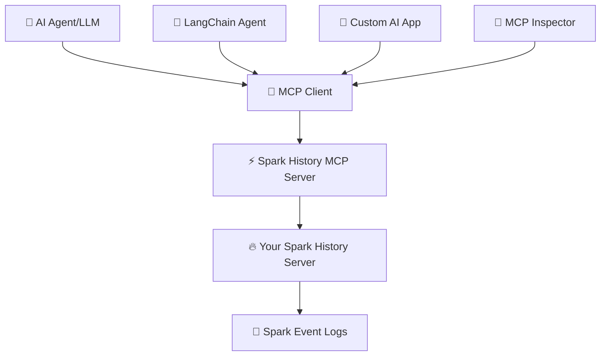

# 🔥 Spark History Server MCP

[](https://github.com/DeepDiagnostix-AI/spark-history-server-mcp/actions)
[](https://www.python.org/downloads/)
[](https://modelcontextprotocol.io/)
[](https://opensource.org/licenses/Apache-2.0)

> **🤖 Connect AI agents to Apache Spark History Server for intelligent job analysis and performance monitoring**

Transform your Spark infrastructure monitoring with AI! This Model Context Protocol (MCP) server enables AI agents to analyze job performance, identify bottlenecks, and provide intelligent insights from your Spark History Server data.

## 🎯 What is This?

**Spark History Server MCP** bridges AI agents with your existing Apache Spark infrastructure, enabling:

- 🔍 **Query job details** through natural language
- 📊 **Analyze performance metrics** across applications
- 🔄 **Compare multiple jobs** to identify regressions
- 🚨 **Investigate failures** with detailed error analysis
- 📈 **Generate insights** from historical execution data

## 🏗️ Architecture



**🔗 Components:**
- **🔥 Spark History Server**: Your existing infrastructure serving Spark event data
- **⚡ MCP Server**: This project - provides MCP tools for querying Spark data
- **🤖 AI Agents**: LangChain, custom agents, or any MCP-compatible client

## ⚡ Quick Start

### 📋 Prerequisites
- 🔥 Existing Spark History Server (running and accessible)
- 🐍 Python 3.12+
- ⚡ [uv](https://docs.astral.sh/uv/getting-started/installation/) package manager

### 🚀 Setup & Testing
```bash
git clone https://github.com/DeepDiagnostix-AI/spark-history-server-mcp.git
cd spark-history-server-mcp

# Install Task (if not already installed)
brew install go-task  # macOS, see https://taskfile.dev/installation/ for others

# Setup and start testing
task install                    # Install dependencies
task start-spark-bg            # Start Spark History Server with sample data (default Spark 3.5.5)
# Or specify a different Spark version:
# task start-spark-bg spark_version=3.5.2
task start-mcp-bg             # Start MCP Server

# Optional: Opens MCP Inspector on http://localhost:6274 for interactive testing
# Requires Node.js: 22.7.5+ (Check https://github.com/modelcontextprotocol/inspector for latest requirements)
task start-inspector-bg       # Start MCP Inspector

# When done, run `task stop-all`
```

### 📊 Sample Data
The repository includes real Spark event logs for testing:
- `spark-bcec39f6201b42b9925124595baad260` - ✅ Successful ETL job
- `spark-110be3a8424d4a2789cb88134418217b` - 🔄 Data processing job
- `spark-cc4d115f011443d787f03a71a476a745` - 📈 Multi-stage analytics job

See **[TESTING.md](TESTING.md)** for using them.

### ⚙️ Server Configuration
Edit `config.yaml` for your Spark History Server:
```yaml
servers:
  local:
    default: true
    url: "http://your-spark-history-server:18080"
    auth:  # optional
      username: "user"
      password: "pass"
mcp:
  transports:
    - streamable-http # streamable-http or stdio.
  port: "18888"
  debug: true
```

## 📸 Screenshots

### 🔍 Get Spark Application


### ⚡ Job Performance Comparison


## 🛠️ Available Tools

<summary><strong>⚠️ Disclaimer</strong></summary>
These tools are subject to change as we scale and improve the performance of the MCP server.

### Core Analysis Tools (All Integrations)
| 🔧 Tool | 📝 Description |
|---------|----------------|
| `get_application` | 📊 Get detailed application information |
| `get_jobs` | 🔗 List jobs within an application |
| `compare_job_performance` | 📈 Compare performance between applications |
| `compare_sql_execution_plans` | 🔎 Compare SQL execution plans |
| `get_job_bottlenecks` | 🚨 Identify performance bottlenecks |
| `get_slowest_jobs` | ⏱️ Find slowest jobs in application |

### Additional Tools (LlamaIndex/LangGraph HTTP Mode)
| 🔧 Tool | 📝 Description |
|---------|----------------|
| `list_applications` | 📋 List Spark applications with filtering |
| `get_application_details` | 📊 Get comprehensive application info |
| `get_stage_details` | ⚡ Analyze stage-level metrics |
| `get_task_details` | 🎯 Examine individual task performance |
| `get_executor_summary` | 🖥️ Review executor utilization |
| `get_application_environment` | ⚙️ Review Spark configuration |
| `get_storage_info` | 💾 Analyze RDD storage usage |
| `get_sql_execution_details` | 🔎 Deep dive into SQL queries |
| `get_resource_usage_timeline` | 📈 Resource allocation over time |
| `compare_job_environments` | ⚙️ Compare Spark configurations |
| `get_slowest_stages` | ⏱️ Find slowest stages |
| `get_task_metrics` | 📊 Detailed task performance metrics |

## 🚀 Production Deployment

Deploy using Kubernetes with Helm:

> ⚠️ **Work in Progress**: We are still testing and will soon publish the container image and Helm registry to GitHub for easy deployment.

```bash
# 📦 Deploy with Helm
helm install spark-history-mcp ./deploy/kubernetes/helm/spark-history-mcp/

# 🎯 Production configuration
helm install spark-history-mcp ./deploy/kubernetes/helm/spark-history-mcp/ \
  --set replicaCount=3 \
  --set autoscaling.enabled=true \
  --set monitoring.enabled=true
```

📚 See [`deploy/kubernetes/helm/`](deploy/kubernetes/helm/) for complete deployment manifests and configuration options.

## 🌐 Multi-Spark History Server Setup
Setup multiple Spark history servers in the config.yaml and choose which server you want the LLM to interact with for each query.

```yaml
servers:
  production:
    default: true
    url: "http://prod-spark-history:18080"
    auth:
      username: "user"
      password: "pass"
  staging:
    url: "http://staging-spark-history:18080"
```

💁 User Query: "Can you get application <app_id> using production server?"

🤖 AI Tool Request:
```
{
  "spark_id": "<app_id>",
  "server": "production"
}
```
🤖 AI Tool Response:
```
{
  "id": "<app_id>>",
  "name": "app_name",
  "coresGranted": null,
  "maxCores": null,
  "coresPerExecutor": null,
  "memoryPerExecutorMB": null,
  "attempts": [
    {
      "attemptId": null,
      "startTime": "2023-09-06T04:44:37.006000Z",
      "endTime": "2023-09-06T04:45:40.431000Z",
      "lastUpdated": "2023-09-06T04:45:42Z",
      "duration": 63425,
      "sparkUser": "spark",
      "appSparkVersion": "3.3.0",
      "completed": true
    }
  ]
}
```

### 🔐 Environment Variables
```bash
SHS_SPARK_USERNAME=your_username
SHS_SPARK_PASSWORD=your_password
SHS_SPARK_TOKEN=your_jwt_token
SHS_MCP_PORT=18888
SHS_MCP_DEBUG=false
SHS_MCP_ADDRESS=0.0.0.0
```

## 🤖 AI Agent Integration

### Quick Start Options

| Integration | Transport | Best For |
|-------------|-----------|----------|
| **[Local Testing](TESTING.md)** | HTTP | Development, testing tools |
| **[Claude Desktop](examples/integrations/claude-desktop/)** | STDIO | Interactive analysis |
| **[Amazon Q CLI](examples/integrations/amazon-q-cli/)** | STDIO | Command-line automation |
| **[LlamaIndex](examples/integrations/llamaindex.md)** | HTTP | Knowledge systems, RAG |
| **[LangGraph](examples/integrations/langgraph.md)** | HTTP | Multi-agent workflows |

## 🎯 Example Use Cases

### 🔍 Performance Investigation
```
🤖 AI Query: "Why is my ETL job running slower than usual?"

📊 MCP Actions:
✅ Analyze application metrics
✅ Compare with historical performance
✅ Identify bottleneck stages
✅ Generate optimization recommendations
```

### 🚨 Failure Analysis
```
🤖 AI Query: "What caused job 42 to fail?"

🔍 MCP Actions:
✅ Examine failed tasks and error messages
✅ Review executor logs and resource usage
✅ Identify root cause and suggest fixes
```

### 📈 Comparative Analysis
```
🤖 AI Query: "Compare today's batch job with yesterday's run"

📊 MCP Actions:
✅ Compare execution times and resource usage
✅ Identify performance deltas
✅ Highlight configuration differences
```

## 📔 Spark History Server Setup

### Setting up Native Spark History Server with MCP

Prereqs
- 🐳 [Docker](https://docs.docker.com/desktop/setup/install/mac-install/) must be installed and running

Steps
- Run `task start-spark`

*Optional: Specify a different Spark version using the `spark_version` parameter:*
```bash
task start-spark spark_version=3.5.2  # Use Spark 3.5.2 instead of default 3.5.5
```
*Although Spark UI is mostly backwards compatible, it is best to use the same Spark History Server version as the version of your Spark application that you are investigating.*

Setup Issues
```bash
# If you get "Docker not running" error:
./start_local_spark_history.sh --dry-run  # Check prerequisites

# If you get "No containers to stop" warning:
# This is normal - just means no previous containers are running

# To get help with script options:
./start_local_spark_history.sh --help
```

### Setting up AWS Glue Spark History Server with MCP

There are two documented methods of setting up Spark history server to Glue

#### Option 1: Launching the Spark history server and viewing the Spark UI using AWS CloudFormation

[Public Documentation](https://docs.aws.amazon.com/glue/latest/dg/monitor-spark-ui-history.html#monitor-spark-ui-history-cfn)

Prereqs
- Ensure you follow the public documentation and setup a Spark Web UI
- Identify the SparkUiPrivateUrl or SparkUiPublicUrl and ensure you can open it in the web browser

Steps
- Open [config.yaml](config.yaml) and add the Web UI URL to your server
``` example
glue_ec2:
  url: "<SparkUiUrl>:<port>"
  verify_ssl: true
  auth:
    username: "staging_user"
    password: "your_password"
    token: "staging_token"
```

Setup Issues
```bash
# If you get "CERTIFICATE_VERIFY_FAILED" error
set verify_ssl: false
```

⚠️ **WARNING**: If verify_ssl is set to False, SSL certificate verification will be disabled.
  This is insecure and should only be used in development environments

#### Option 2: Launching the Spark history server and viewing the Spark UI using Docker

[Public Documentation](https://docs.aws.amazon.com/glue/latest/dg/monitor-spark-ui-history.html#monitor-spark-ui-history-local)

Prereqs
- 🐳 [Docker](https://docs.docker.com/desktop/setup/install/mac-install/) must be installed and running

Steps:
- Follow steps in public doc to get Docker running http://localhost:18080 in your browser
- Ensure [config.yaml](config.yaml) local server has correct url:
```
local:
    default: true  # if server name is not provided in tool calls, this Spark History Server is used
    url: "http://localhost:18080"
    verify_ssl: true
    # Optional authentication (can also use environment variables)
    # auth:
    #   username: "your_username"  # or use SHS_SPARK_USERNAME env var
    #   password: "your_password"  # or use SHS_SPARK_PASSWORD env var
    #   token: "your_token"       # or use SHS_SPARK_TOKEN env var
```

## 🤝 Contributing

Check [CONTRIBUTING.md](CONTRIBUTING.md) for full guidelines on contributions

## 📄 License

Apache License 2.0 - see [LICENSE](LICENSE) file for details.


---

<div align="center">

**🔥 Connect your Spark infrastructure to AI agents**

[🚀 Get Started](#-quick-start) | [🛠️ View Tools](#%EF%B8%8F-available-tools) | [🧪 Test Now](TESTING.md) | [🤝 Contribute](#-contributing)

*Built by the community, for the community* 💙

</div>
