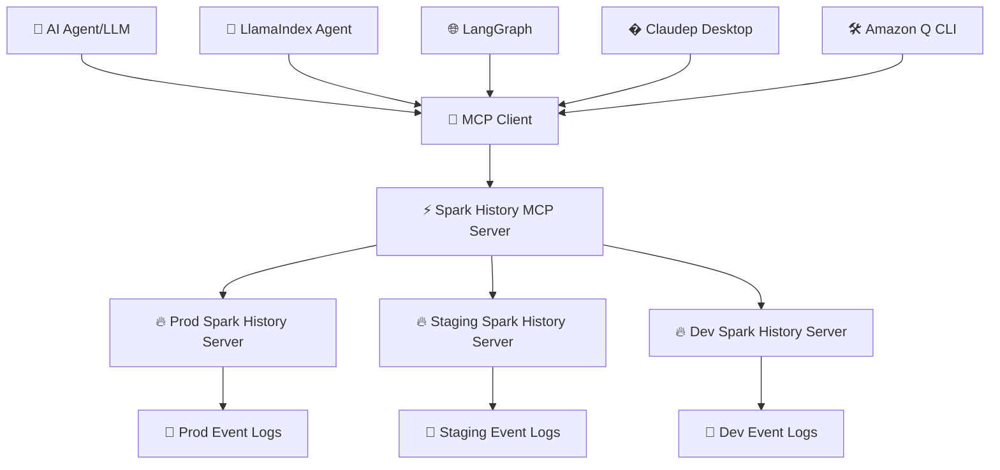
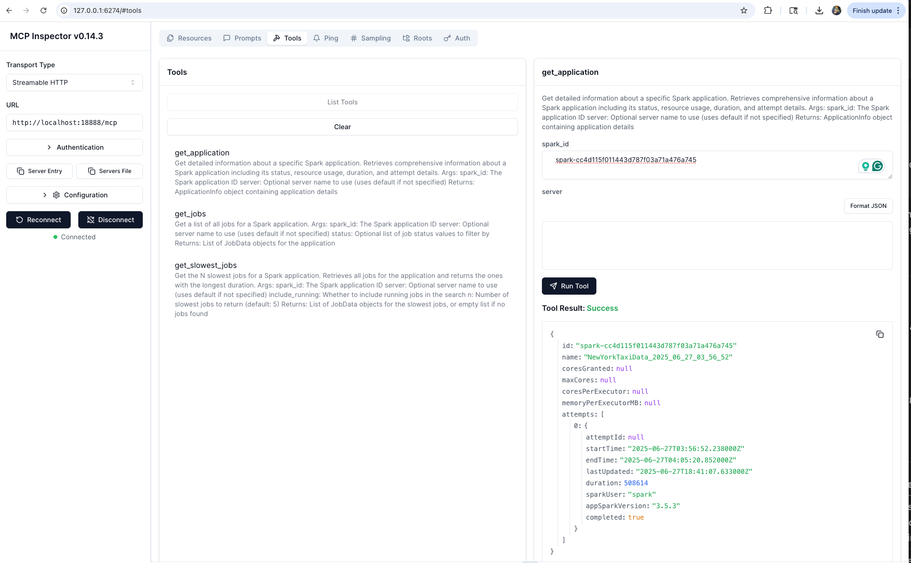
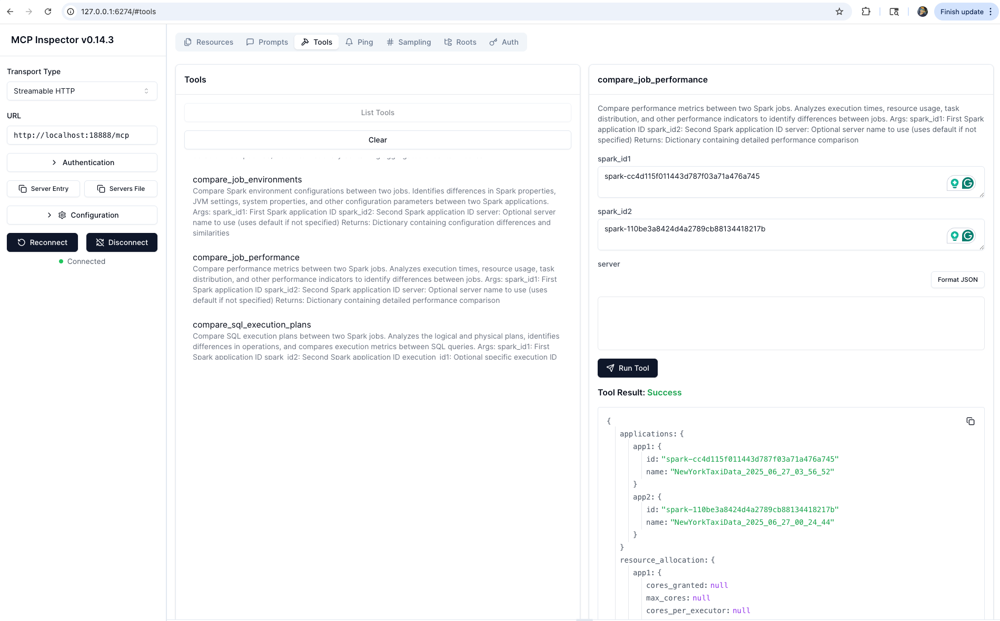

# MCP Server for Apache Spark History Server

[](https://github.com/DeepDiagnostix-AI/mcp-apache-spark-history-server/actions)
[](https://www.python.org/downloads/)
[](https://modelcontextprotocol.io/)
[](https://opensource.org/licenses/Apache-2.0)

> **🤖 Connect AI agents to Apache Spark History Server for intelligent job analysis and performance monitoring**

Transform your Spark infrastructure monitoring with AI! This Model Context Protocol (MCP) server enables AI agents to analyze job performance, identify bottlenecks, and provide intelligent insights from your Spark History Server data.

## 🎯 What is This?

**Spark History Server MCP** bridges AI agents with your existing Apache Spark infrastructure, enabling:

- 🔍 **Query job details** through natural language
- 📊 **Analyze performance metrics** across applications
- 🔄 **Compare multiple jobs** to identify regressions
- 🚨 **Investigate failures** with detailed error analysis
- 📈 **Generate insights** from historical execution data

📺 **See it in action:**

[](https://www.youtube.com/watch?v=e3P_2_RiUHw)


## 🏗️ Architecture



**🔗 Components:**
- **🔥 Spark History Server**: Your existing infrastructure serving Spark event data
- **⚡ MCP Server**: This project - provides MCP tools for querying Spark data
- **🤖 AI Agents**: LangChain, custom agents, or any MCP-compatible client

## ⚡ Quick Start

### 📋 Prerequisites
- 🔥 Existing Spark History Server (running and accessible)
- 🐍 Python 3.12+
- ⚡ [uv](https://docs.astral.sh/uv/getting-started/installation/) package manager

### 🚀 Setup & Testing

```bash
git clone https://github.com/DeepDiagnostix-AI/mcp-apache-spark-history-server.git
cd mcp-apache-spark-history-server

# Install Task (if not already installed)
brew install go-task  # macOS, see https://taskfile.dev/installation/ for others

# Setup and start testing
task start-spark-bg            # Start Spark History Server with sample data (default Spark 3.5.5)
# Or specify a different Spark version:
# task start-spark-bg spark_version=3.5.2
task start-mcp-bg             # Start MCP Server

# Optional: Opens MCP Inspector on http://localhost:6274 for interactive testing
# Requires Node.js: 22.7.5+ (Check https://github.com/modelcontextprotocol/inspector for latest requirements)
task start-inspector-bg       # Start MCP Inspector

# When done, run `task stop-all`
```

If you just want to run the MCP server without cloning the repository:

```bash
# Run with uv without installing the module
uvx --from mcp-apache-spark-history-server spark-mcp

# OR run with pip and python. Use of venv is highly encouraged.
python3 -m venv spark-mcp && source spark-mcp/bin/activate
pip install mcp-apache-spark-history-server
python3 -m spark_history_mcp.core.main
# Deactivate venv
deactivate
```


### 📊 Sample Data
The repository includes real Spark event logs for testing:
- `spark-bcec39f6201b42b9925124595baad260` - ✅ Successful ETL job
- `spark-110be3a8424d4a2789cb88134418217b` - 🔄 Data processing job
- `spark-cc4d115f011443d787f03a71a476a745` - 📈 Multi-stage analytics job

See **[TESTING.md](TESTING.md)** for using them.

### ⚙️ Server Configuration
Edit `config.yaml` for your Spark History Server:
```yaml
servers:
  local:
    default: true
    url: "http://your-spark-history-server:18080"
    auth:  # optional
      username: "user"
      password: "pass"
mcp:
  transports:
    - streamable-http # streamable-http or stdio.
  port: "18888"
  debug: true
```

## 📸 Screenshots

### 🔍 Get Spark Application


### ⚡ Job Performance Comparison



## 🛠️ Available Tools

> **Note**: These tools are subject to change as we scale and improve the performance of the MCP server.

The MCP server provides **17 specialized tools** organized by analysis patterns. LLMs can intelligently select and combine these tools based on user queries:

### 📊 Application Information
*Basic application metadata and overview*
| 🔧 Tool | 📝 Description |
|---------|----------------|
| `get_application` | 📊 Get detailed information about a specific Spark application including status, resource usage, duration, and attempt details |

### 🔗 Job Analysis
*Job-level performance analysis and identification*
| 🔧 Tool | 📝 Description |
|---------|----------------|
| `list_jobs` | 🔗 Get a list of all jobs for a Spark application with optional status filtering |
| `list_slowest_jobs` | ⏱️ Get the N slowest jobs for a Spark application (excludes running jobs by default) |

### ⚡ Stage Analysis
*Stage-level performance deep dive and task metrics*
| 🔧 Tool | 📝 Description |
|---------|----------------|
| `list_stages` | ⚡ Get a list of all stages for a Spark application with optional status filtering and summaries |
| `list_slowest_stages` | 🐌 Get the N slowest stages for a Spark application (excludes running stages by default) |
| `get_stage` | 🎯 Get information about a specific stage with optional attempt ID and summary metrics |
| `get_stage_task_summary` | 📊 Get statistical distributions of task metrics for a specific stage (execution times, memory usage, I/O metrics) |

### 🖥️ Executor & Resource Analysis
*Resource utilization, executor performance, and allocation tracking*
| 🔧 Tool | 📝 Description |
|---------|----------------|
| `list_executors` | 🖥️ Get executor information with optional inactive executor inclusion |
| `get_executor` | 🔍 Get information about a specific executor including resource allocation, task statistics, and performance metrics |
| `get_executor_summary` | 📈 Aggregates metrics across all executors (memory usage, disk usage, task counts, performance metrics) |
| `get_resource_usage_timeline` | 📅 Get chronological view of resource allocation and usage patterns including executor additions/removals |

### ⚙️ Configuration & Environment
*Spark configuration, environment variables, and runtime settings*
| 🔧 Tool | 📝 Description |
|---------|----------------|
| `get_environment` | ⚙️ Get comprehensive Spark runtime configuration including JVM info, Spark properties, system properties, and classpath |

### 🔎 SQL & Query Analysis
*SQL performance analysis and execution plan comparison*
| 🔧 Tool | 📝 Description |
|---------|----------------|
| `list_slowest_sql_queries` | 🐌 Get the top N slowest SQL queries for an application with detailed execution metrics |
| `compare_sql_execution_plans` | 🔍 Compare SQL execution plans between two Spark jobs, analyzing logical/physical plans and execution metrics |

### 🚨 Performance & Bottleneck Analysis
*Intelligent bottleneck identification and performance recommendations*
| 🔧 Tool | 📝 Description |
|---------|----------------|
| `get_job_bottlenecks` | 🚨 Identify performance bottlenecks by analyzing stages, tasks, and executors with actionable recommendations |

### 🔄 Comparative Analysis
*Cross-application comparison for regression detection and optimization*
| 🔧 Tool | 📝 Description |
|---------|----------------|
| `compare_job_environments` | ⚙️ Compare Spark environment configurations between two jobs to identify differences in properties and settings |
| `compare_job_performance` | 📈 Compare performance metrics between two Spark jobs including execution times, resource usage, and task distribution |

### 🤖 How LLMs Use These Tools

**Query Pattern Examples:**
- *"Why is my job slow?"* → `get_job_bottlenecks` + `list_slowest_stages` + `get_executor_summary`
- *"Compare today vs yesterday"* → `compare_job_performance` + `compare_job_environments`
- *"What's wrong with stage 5?"* → `get_stage` + `get_stage_task_summary`
- *"Show me resource usage over time"* → `get_resource_usage_timeline` + `get_executor_summary`
- *"Find my slowest SQL queries"* → `list_slowest_sql_queries` + `compare_sql_execution_plans`

## 📔 AWS Integration Guides

If you are an existing AWS user looking to analyze your Spark Applications, we provide detailed setup guides for:

- **[AWS Glue Users](examples/aws/glue/README.md)** - Connect to Glue Spark History Server
- **[Amazon EMR Users](examples/aws/emr/README.md)** - Use EMR Persistent UI for Spark analysis

These guides provide step-by-step instructions for setting up the Spark History Server MCP with your AWS services.

## 🚀 Kubernetes Deployment

Deploy using Kubernetes with Helm:

> ⚠️ **Work in Progress**: We are still testing and will soon publish the container image and Helm registry to GitHub for easy deployment.

```bash
# 📦 Deploy with Helm
helm install spark-history-mcp ./deploy/kubernetes/helm/spark-history-mcp/

# 🎯 Production configuration
helm install spark-history-mcp ./deploy/kubernetes/helm/spark-history-mcp/ \
  --set replicaCount=3 \
  --set autoscaling.enabled=true \
  --set monitoring.enabled=true
```

📚 See [`deploy/kubernetes/helm/`](deploy/kubernetes/helm/) for complete deployment manifests and configuration options.

## 🌐 Multi-Spark History Server Setup
Setup multiple Spark history servers in the config.yaml and choose which server you want the LLM to interact with for each query.

```yaml
servers:
  production:
    default: true
    url: "http://prod-spark-history:18080"
    auth:
      username: "user"
      password: "pass"
  staging:
    url: "http://staging-spark-history:18080"
```

💁 User Query: "Can you get application <app_id> using production server?"

🤖 AI Tool Request:
```json
{
  "app_id": "<app_id>",
  "server": "production"
}
```
🤖 AI Tool Response:
```json
{
  "id": "<app_id>>",
  "name": "app_name",
  "coresGranted": null,
  "maxCores": null,
  "coresPerExecutor": null,
  "memoryPerExecutorMB": null,
  "attempts": [
    {
      "attemptId": null,
      "startTime": "2023-09-06T04:44:37.006000Z",
      "endTime": "2023-09-06T04:45:40.431000Z",
      "lastUpdated": "2023-09-06T04:45:42Z",
      "duration": 63425,
      "sparkUser": "spark",
      "appSparkVersion": "3.3.0",
      "completed": true
    }
  ]
}
```

### 🔐 Environment Variables
```
SHS_MCP_PORT - Port for MCP server (default: 18888)
SHS_MCP_DEBUG - Enable debug mode (default: false)
SHS_MCP_ADDRESS - Address for MCP server (default: localhost)
SHS_MCP_TRANSPORT - MCP transport mode (default: streamable-http)
SHS_SERVERS_*_URL - URL for a specific server
SHS_SERVERS_*_AUTH_USERNAME - Username for a specific server
SHS_SERVERS_*_AUTH_PASSWORD - Password for a specific server
SHS_SERVERS_*_AUTH_TOKEN - Token for a specific server
SHS_SERVERS_*_VERIFY_SSL - Whether to verify SSL for a specific server (true/false)
SHS_SERVERS_*_EMR_CLUSTER_ARN - EMR cluster ARN for a specific server
```

## 🤖 AI Agent Integration

### Quick Start Options

| Integration | Transport | Best For |
|-------------|-----------|----------|
| **[Local Testing](TESTING.md)** | HTTP | Development, testing tools |
| **[Claude Desktop](examples/integrations/claude-desktop/)** | STDIO | Interactive analysis |
| **[Amazon Q CLI](examples/integrations/amazon-q-cli/)** | STDIO | Command-line automation |
| **[Kiro](examples/integrations/kiro/)** | HTTP | IDE integration, code-centric analysis |
| **[LangGraph](examples/integrations/langgraph/)** | HTTP | Multi-agent workflows |
| **[Strands Agents](examples/integrations/strands-agents/)** | HTTP | Multi-agent workflows |

## 🎯 Example Use Cases

### 🔍 Performance Investigation
```
🤖 AI Query: "Why is my ETL job running slower than usual?"

📊 MCP Actions:
✅ Analyze application metrics
✅ Compare with historical performance
✅ Identify bottleneck stages
✅ Generate optimization recommendations
```

### 🚨 Failure Analysis
```
🤖 AI Query: "What caused job 42 to fail?"

🔍 MCP Actions:
✅ Examine failed tasks and error messages
✅ Review executor logs and resource usage
✅ Identify root cause and suggest fixes
```

### 📈 Comparative Analysis
```
🤖 AI Query: "Compare today's batch job with yesterday's run"

📊 MCP Actions:
✅ Compare execution times and resource usage
✅ Identify performance deltas
✅ Highlight configuration differences
```

## 🤝 Contributing

Check [CONTRIBUTING.md](CONTRIBUTING.md) for full guidelines on contributions

## 📄 License

Apache License 2.0 - see [LICENSE](LICENSE) file for details.


## 📝 Trademark Notice

*This project is built for use with Apache Spark™ History Server. Not affiliated with or endorsed by the Apache Software Foundation.*

---

<div align="center">

**🔥 Connect your Spark infrastructure to AI agents**

[🚀 Get Started](#-quick-start) | [🛠️ View Tools](#%EF%B8%8F-available-tools) | [🧪 Test Now](TESTING.md) | [🤝 Contribute](#-contributing)

*Built by the community, for the community* 💙

</div>
