# 🔥 Spark History Server MCP

[](https://github.com/DeepDiagnostix-AI/spark-history-server-mcp/actions)
[](https://www.python.org/downloads/)
[](https://modelcontextprotocol.io/)
[](https://opensource.org/licenses/Apache-2.0)

> **🤖 Connect AI agents to Apache Spark History Server for intelligent job analysis and performance monitoring**

Transform your Spark infrastructure monitoring with AI! This Model Context Protocol (MCP) server enables AI agents to analyze job performance, identify bottlenecks, and provide intelligent insights from your Spark History Server data.

## 🎯 What is This?

**Spark History Server MCP** bridges AI agents with your existing Apache Spark infrastructure, enabling:

- 🔍 **Query job details** through natural language
- 📊 **Analyze performance metrics** across applications
- 🔄 **Compare multiple jobs** to identify regressions
- 🚨 **Investigate failures** with detailed error analysis
- 📈 **Generate insights** from historical execution data

## 🏗️ Architecture

```mermaid
graph TB
    A[🤖 AI Agent/LLM] --> B[📡 MCP Client]
    B --> C[⚡ Spark History MCP Server]
    C --> D[🔥 Your Spark History Server]
    D --> E[📄 Spark Event Logs]

    F[🔧 LangChain Agent] --> B
    G[📱 Custom AI App] --> B
    H[🔬 MCP Inspector] --> B
```



**🔗 Components:**
- **🔥 Spark History Server**: Your existing infrastructure serving Spark event data
- **⚡ MCP Server**: This project - provides MCP tools for querying Spark data
- **🤖 AI Agents**: LangChain, custom agents, or any MCP-compatible client

## ⚡ Quick Start

### 📋 Prerequisites
- 🔥 Existing Spark History Server (running and accessible)
- 🐍 Python 3.12+
- ⚡ [uv](https://docs.astral.sh/uv/getting-started/installation/) package manager

### 🚀 Setup & Testing
```bash
git clone https://github.com/DeepDiagnostix-AI/spark-history-server-mcp.git
cd spark-history-server-mcp

# Install Task (if not already installed)
brew install go-task  # macOS, see https://taskfile.dev/installation/ for others

# Setup and start testing
task install                    # Install dependencies
task start-spark-bg            # Start Spark History Server with sample data
task start-mcp-bg             # Start MCP Server
task start-inspector-bg       # Start MCP Inspector

# Opens http://localhost:6274 for interactive testing
# When done: task stop-all
```

### ⚙️ Configuration
Edit `config.yaml` for your Spark History Server:
```yaml
servers:
  local:
    default: true
    url: "http://your-spark-history-server:18080"
    auth:  # optional
      username: "user"
      password: "pass"
```

## 📸 Screenshots

### 🔍 Get Spark Application


### ⚡ Job Performance Comparison


## 🛠️ Available Tools

### Core Analysis Tools (All Integrations)
| 🔧 Tool | 📝 Description |
|---------|----------------|
| `get_application` | 📊 Get detailed application information |
| `get_jobs` | 🔗 List jobs within an application |
| `compare_job_performance` | 📈 Compare performance between applications |
| `compare_sql_execution_plans` | 🔎 Compare SQL execution plans |
| `get_job_bottlenecks` | 🚨 Identify performance bottlenecks |
| `get_slowest_jobs` | ⏱️ Find slowest jobs in application |

### Additional Tools (LlamaIndex/LangGraph HTTP Mode)
| 🔧 Tool | 📝 Description |
|---------|----------------|
| `list_applications` | 📋 List Spark applications with filtering |
| `get_application_details` | 📊 Get comprehensive application info |
| `get_stage_details` | ⚡ Analyze stage-level metrics |
| `get_task_details` | 🎯 Examine individual task performance |
| `get_executor_summary` | 🖥️ Review executor utilization |
| `get_application_environment` | ⚙️ Review Spark configuration |
| `get_storage_info` | 💾 Analyze RDD storage usage |
| `get_sql_execution_details` | 🔎 Deep dive into SQL queries |
| `get_resource_usage_timeline` | 📈 Resource allocation over time |
| `compare_job_environments` | ⚙️ Compare Spark configurations |
| `get_slowest_stages` | ⏱️ Find slowest stages |
| `get_task_metrics` | 📊 Detailed task performance metrics |

## 🚀 Production Deployment

Deploy using Kubernetes with Helm:

> ⚠️ **Work in Progress**: We are still testing and will soon publish the container image and Helm registry to GitHub for easy deployment.

```bash
# 📦 Deploy with Helm
helm install spark-history-mcp ./deploy/kubernetes/helm/spark-history-mcp/

# 🎯 Production configuration
helm install spark-history-mcp ./deploy/kubernetes/helm/spark-history-mcp/ \
  --set replicaCount=3 \
  --set autoscaling.enabled=true \
  --set monitoring.enabled=true
```

📚 See [`deploy/kubernetes/helm/`](deploy/kubernetes/helm/) for complete deployment manifests and configuration options.

## 📊 Sample Data
The repository includes real Spark event logs for testing:
- `spark-bcec39f6201b42b9925124595baad260` - ✅ Successful ETL job
- `spark-110be3a8424d4a2789cb88134418217b` - 🔄 Data processing job
- `spark-cc4d115f011443d787f03a71a476a745` - 📈 Multi-stage analytics job

📖 **Advanced testing**: **[TESTING.md](TESTING.md)**

## ⚙️ Configuration

### 🌐 Multi-server Setup
```yaml
servers:
  production:
    default: true
    url: "http://prod-spark-history:18080"
    auth:
      username: "user"
      password: "pass"
  staging:
    url: "http://staging-spark-history:18080"
```

### 🔐 Environment Variables
```bash
SPARK_USERNAME=your_username
SPARK_PASSWORD=your_password
SPARK_TOKEN=your_jwt_token
MCP_PORT=18888
MCP_DEBUG=false
```

## 🤖 AI Agent Integration

### Quick Start Options

| Integration | Transport | Entry Point | Best For |
|-------------|-----------|-------------|----------|
| **[Local Testing](TESTING.md)** | HTTP | `main.py` | Development, testing tools |
| **[Claude Desktop](examples/integrations/claude-desktop/)** | STDIO | `main_stdio.py` | Interactive analysis |
| **[Amazon Q CLI](examples/integrations/amazon-q-cli/)** | STDIO | `main_stdio.py` | Command-line automation |
| **[LlamaIndex](examples/integrations/llamaindex.md)** | HTTP | `main.py` | Knowledge systems, RAG |
| **[LangGraph](examples/integrations/langgraph.md)** | HTTP | `main.py` | Multi-agent workflows |

**Note**: Claude Desktop and Amazon Q CLI use STDIO transport with 6 core tools. LlamaIndex/LangGraph use HTTP transport with 18 comprehensive tools.

## 🎯 Example Use Cases

### 🔍 Performance Investigation
```
🤖 AI Query: "Why is my ETL job running slower than usual?"

📊 MCP Actions:
✅ Analyze application metrics
✅ Compare with historical performance
✅ Identify bottleneck stages
✅ Generate optimization recommendations
```

### 🚨 Failure Analysis
```
🤖 AI Query: "What caused job 42 to fail?"

🔍 MCP Actions:
✅ Examine failed tasks and error messages
✅ Review executor logs and resource usage
✅ Identify root cause and suggest fixes
```

### 📈 Comparative Analysis
```
🤖 AI Query: "Compare today's batch job with yesterday's run"

📊 MCP Actions:
✅ Compare execution times and resource usage
✅ Identify performance deltas
✅ Highlight configuration differences
```

## 🤝 Contributing

1. 🍴 Fork the repository
2. 🌿 Create feature branch: `git checkout -b feature/new-tool`
3. 🧪 Add tests for new functionality
4. ✅ Run tests: `task test`
5. 📤 Submit pull request

## 📄 License

Apache License 2.0 - see [LICENSE](LICENSE) file for details.


---

<div align="center">

**🔥 Connect your Spark infrastructure to AI agents**

[🚀 Get Started](#-quick-start) | [🛠️ View Tools](#%EF%B8%8F-available-tools) | [🧪 Test Now](TESTING.md) | [🤝 Contribute](#-contributing)

*Built by the community, for the community* 💙

</div>
