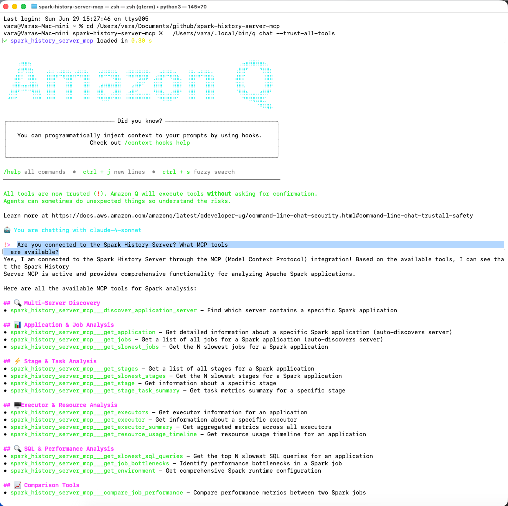

# Amazon Q CLI Integration

Connect Amazon Q CLI to Spark History Server for command-line Spark analysis.

## Prerequisites

1. **Clone and setup repository**:
```bash
git clone https://github.com/DeepDiagnostix-AI/spark-history-server-mcp.git
cd spark-history-server-mcp

# Install Task (if not already installed)
brew install go-task  # macOS
# or see https://taskfile.dev/installation/ for other platforms

# Setup dependencies
task install
```

2. **Start Spark History Server with sample data**:
```bash
task start-spark-bg
# Starts server at http://localhost:18080 with 3 sample applications
```

3. **Verify setup**:
```bash
curl http://localhost:18080/api/v1/applications
# Should return 3 applications
```

## Setup

1. **Add MCP server**:
```bash
q mcp add \
  --name spark-history-server \
  --command /<Local Path to Repo>/spark-history-server-mcp/spark_history_server_mcp_launcher.sh \
  --args "-p", "q_cli" \
  --env SHS_MCP_TRANSPORT=stdio \
  --scope global
```

Results should look something like this
```
cat ~/.aws/amazonq/mcp.json

{
  "mcpServers": {
    "spark-history-server": {
      "command": "/<Local Path to Repo>/spark-history-server-mcp/spark_history_server_mcp_launcher.sh",
      "args": [
        "-p",
        "q_cli" # pre-appends to mcp_server_output.log
      ],
      "env": {
        "SHS_MCP_TRANSPORT": "stdio"
      },
      "timeout": 120000,
      "disabled": false
    }
}
```

2. **Test connection**

## Usage

Start interactive session:
```bash
q chat
```



Example query:
```
Compare performance between spark-cc4d115f011443d787f03a71a476a745 and spark-110be3a8424d4a2789cb88134418217b
```

## Batch Analysis
```bash
echo "What are the bottlenecks in spark-cc4d115f011443d787f03a71a476a745?"
```

## Management
- List servers: `q mcp list`
- Remove: `q mcp remove --name spark-history-server-mcp`

## Remote Spark History Server

To connect to a remote Spark History Server, edit `config.yaml` in the repository:

```yaml
servers:
  production:
    default: true
    url: "https://spark-history-prod.company.com:18080"
    auth:
      username: "user"
      password: "pass"
```

**Note**: Amazon Q CLI requires local MCP server execution. For remote MCP servers, consider:
- SSH tunnel: `ssh -L 18080:remote-server:18080 user@server`
- Deploy MCP server locally pointing to remote Spark History Server

## Troubleshooting
- **Path errors**: Use full paths (`which uv`)
- **Connection fails**: Check Spark History Server is running and accessible
