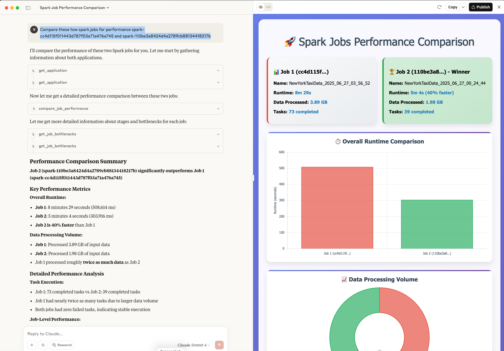

# Claude Desktop Integration

Connect Claude Desktop to Spark History Server for AI-powered job analysis.

## Prerequisites

1. **Clone and setup repository**:
```bash
git clone https://github.com/DeepDiagnostix-AI/spark-history-server-mcp.git
cd spark-history-server-mcp

# Install Task (if not already installed)
brew install go-task  # macOS
# or see https://taskfile.dev/installation/ for other platforms

# Setup dependencies
task install
```

2. **Start Spark History Server with sample data**:
```bash
task start-spark-bg
# Starts server at http://localhost:18080 with 3 sample applications
```

3. **Verify setup**:
```bash
curl http://localhost:18080/api/v1/applications
# Should return 3 applications
```

## Setup

1. **Configure Claude Desktop** (`~/Library/Application Support/Claude/claude_desktop_config.json`):

```json
{
    "mcpServers": {
        "spark-history-server-mcp": {
            "command": "uv",
            "args": ["run", "-m", "spark_history_mcp.core.main"]
        }
    }
}
```

**⚠️ Important**: Replace `/Users/username/spark-history-server-mcp` with your actual repository path.

2. **Restart Claude Desktop**

## Test Connection

Ask Claude: "Are you connected to the Spark History Server? What tools are available?"

You should see 6 core tools for Spark analysis:
- get_application, get_jobs, compare_job_performance, compare_sql_execution_plans, get_job_bottlenecks, get_slowest_jobs

## Example Usage

```
Compare performance between these Spark applications:
- spark-cc4d115f011443d787f03a71a476a745
- spark-110be3a8424d4a2789cb88134418217b

Analyze execution times, bottlenecks, and provide optimization recommendations.
```



## Available Tools

- `get_application` - Application details
- `get_jobs` - Job information
- `compare_job_performance` - Performance comparison
- `compare_sql_execution_plans` - SQL plan analysis
- `get_job_bottlenecks` - Identify issues
- `get_slowest_jobs` - Find slow jobs

## Remote Spark History Server

To connect to a remote Spark History Server, edit `config.yaml` in the repository:

```yaml
servers:
  production:
    default: true
    url: "https://spark-history-prod.company.com:18080"
    auth:
      username: "user"
      password: "pass"
```

**Note**: Claude Desktop requires local MCP server execution. For remote MCP servers, consider:
- SSH tunnel: `ssh -L 18080:remote-server:18080 user@server`
- Deploy MCP server locally pointing to remote Spark History Server

## Troubleshooting

- **Connection fails**: Check paths in config file
- **No tools**: Restart Claude Desktop
- **No apps found**: Ensure Spark History Server is running and accessible
