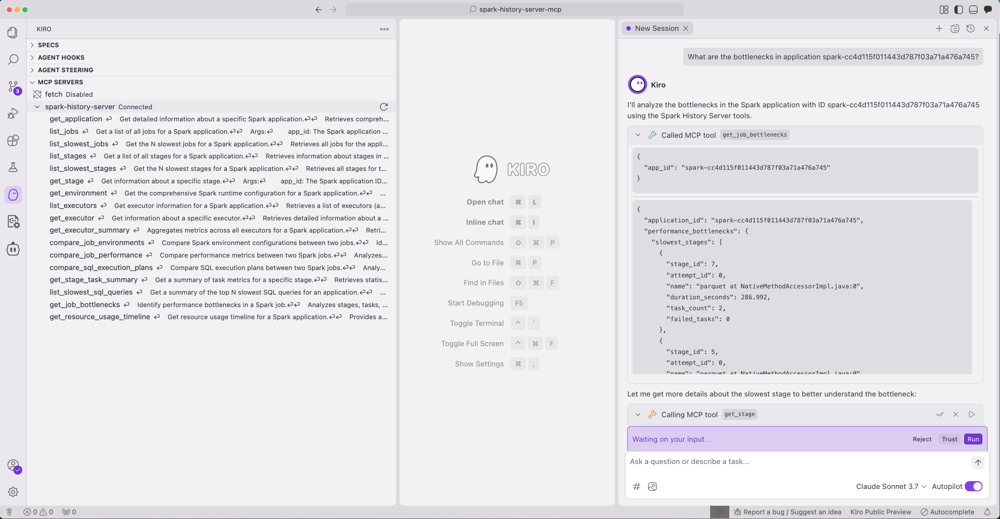

# Kiro IDE Integration

Connect Kiro IDE to Spark History Server for intelligent Spark analysis directly in your development environment.

## Prerequisites

1. **Download and Install Kiro:**
Follow the installation steps in the [public documentation](https://kiro.dev/docs/getting-started/installation/)

2. **Clone and setup repository**:
```bash
git clone https://github.com/DeepDiagnostix-AI/mcp-apache-spark-history-server.git
cd mcp-apache-spark-history-server

# Install Task (if not already installed)
brew install go-task  # macOS
# or see https://taskfile.dev/installation/ for other platforms

# Setup dependencies
task install
```

3. **Start Spark History Server with sample data**:
```bash
task start-spark-bg
# Starts server at http://localhost:18080 with 3 sample applications
```

4. **Verify setup**:
```bash
curl http://localhost:18080/api/v1/applications
# Should return 3 applications
```

## Setup

1. **Configure MCP server in Kiro**:

Follow the instructions listed here: https://kiro.dev/docs/mcp/

Create or edit the Kiro MCP configuration file at `.kiro/settings/mcp.json` in your workspace:

```json
{
  "mcpServers": {
    "spark-history-server": {
      "command": "/<LOCAL_PATH_TO_REPO>/spark-history-server-mcp/spark_history_server_mcp_launcher.sh",
      "args": ["-p", "kiro"],
      "env": {
        "SHS_MCP_TRANSPORT": "stdio"
      },
      "disabled": false,
      "autoApprove": []
    }
  }
}
```

2. **Restart Kiro or reconnect MCP servers** from the Kiro feature panel.

## Usage

Once connected, you can interact with your Spark History Server directly in Kiro:



Example queries:
```
What are the bottlenecks in application spark-cc4d115f011443d787f03a71a476a745?

Compare performance between spark-cc4d115f011443d787f03a71a476a745 and spark-110be3a8424d4a2789cb88134418217b.

Show me the slowest stages in application spark-bcec39f6201b42b9925124595baad260.
```

## Advanced Configuration

### Remote Spark History Server

To connect to a remote Spark History Server, edit `config.yaml` in the repository:

```yaml
servers:
  production:
    default: true
    url: "https://spark-history-prod.company.com:18080"
    auth:
      username: "user"
      password: "pass"
```

### Multiple Spark History Servers

You can configure multiple Spark History Servers in your `config.yaml` and specify which one to use in your queries:

```yaml
servers:
  production:
    default: true
    url: "https://spark-history-prod.company.com:18080"
    auth:
      username: "user"
      password: "pass"
  staging:
    url: "https://spark-history-staging.company.com:18080"
    auth:
      username: "user"
      password: "pass"
```

Then in Kiro, you can specify which server to use:
```
Show me the slowest jobs in application app-123 using the staging server.
```

## Troubleshooting

- **Connection issues**: Ensure the Spark History Server is running and accessible
- **MCP server not responding**: Check the Kiro logs for connection errors
- **Missing data**: Verify that your Spark applications are properly registered in the History Server
