# LangGraph Integration Example

> **🚧 BLUEPRINT DISCLAIMER**: This is an **example blueprint** demonstrating how to integrate LangGraph with Spark History Server MCP and Local LLMs (Ollama). This is designed for **demonstration, learning, and prototyping purposes only**.
>
> **To build a production-ready agent**, you should extend this code with:
> - Comprehensive error handling and retry logic
> - Authentication and authorization mechanisms
> - Security measures and input validation
> - Monitoring, logging, and observability
> - Rate limiting and resource management
> - Custom business logic specific to your use case
> - Database persistence and state management
> - API endpoints and web interfaces
>
> **Use this as a starting point** to understand the integration patterns, then build upon it for your specific requirements.

This example demonstrates how to integrate **Spark History Server MCP** with **LangGraph** for interactive Spark performance analysis using **local AI models** (Ollama).

## Architecture

```mermaid
flowchart TD
    A[👤 User Input] --> B[🔄 LangGraph StateGraph]
    B --> C[🛠️ MCP Tools]
    C --> D[🔥 Spark History Server]
    B --> E[🧠 ChatOllama Local LLM]
    E --> F[🔍 Analysis & Reasoning]
    F --> G[💻 Terminal Output]

    D --> C
    C --> B

    style A fill:#e1f5fe
    style B fill:#f3e5f5
    style C fill:#e8f5e8
    style D fill:#fff3e0
    style E fill:#fce4ec
    style F fill:#f1f8e9
    style G fill:#e0f2f1

    classDef userFlow stroke:#1976d2,stroke-width:2px
    classDef dataFlow stroke:#388e3c,stroke-width:2px
    classDef aiFlow stroke:#7b1fa2,stroke-width:2px

    class A,G userFlow
    class C,D dataFlow
    class E,F aiFlow
```



**Key Components:**
- **MCP Client**: `langchain_mcp_adapters.MultiServerMCPClient` with streamable HTTP
- **LLM**: `ChatOllama` with qwen3:1.7b for local AI reasoning
- **StateGraph**: LangGraph workflow with tool-calling capabilities
- **Tools**: 17 MCP tools for comprehensive Spark History Server data access

## Model Comparison

| Model | Storage | Quality | Speed | Use Case |
|-------|---------|---------|-------|----------|
| **qwen3:0.6b** | 522 MB | Basic | Fast | Low storage, quick responses |
| **qwen3:1.7b** | 1.4 GB | **Better** | Moderate | **🌟 Recommended default** |


## Sample Application IDs

The example comes with these pre-loaded Spark applications:

```
spark-cc4d115f011443d787f03a71a476a745  # NewYorkTaxiData
spark-bcec39f6201b42b9925124595baad260  # PythonPi
spark-110be3a8424d4a2789cb88134418217b  # NewYorkTaxiData_2
```

## Features

✅ **Interactive Chat Interface** - Natural language queries about Spark applications
✅ **MCP Integration** - Uses `langchain-mcp-adapters` with streamable HTTP transport
✅ **Local AI** - Ollama integration for privacy and speed (qwen3:1.7b default)
✅ **Cross-Platform** - Works on Mac/Windows/Linux with UV virtual environment
✅ **Spark History Server MCP Tools** - Comprehensive Spark analysis capabilities


## Prerequisites

Before starting, ensure you have:
- **Python 3.9+** installed on your system
- **UV package manager** ([Installation guide](https://docs.astral.sh/uv/getting-started/installation/))
- **Node.js** (if using task runner)
- **Git** for cloning the repository

## Installation & Setup

### Step 1: Start Required Services (from project root)

```bash
# Navigate to project root first
cd mcp-apache-spark-history-server

# Start Spark History Server with sample data
task start-spark-bg

# Start MCP Server
task start-mcp-bg

# Verify services are running
curl http://localhost:18080/api/v1/applications  # Should return JSON
curl http://localhost:18888/                     # Should return 404 (normal)
```

**✅ Verification**: Both commands should return responses without connection errors.

### Step 2: Navigate to LangGraph Example

```bash
cd examples/integrations/langgraph
```

### Step 3: Setup Python Environment

```bash
# Create virtual environment with UV (cross-platform)
uv venv

# Activate virtual environment
source .venv/bin/activate          # On macOS/Linux
# OR on Windows:
# .venv\Scripts\activate

# Install locked dependencies
uv pip install -r requirements.txt

# Verify Python dependencies
python3 -c "import langchain_mcp_adapters, langgraph, langchain_ollama; print('✅ All Python dependencies installed')"
```

**✅ Verification**: The import command should print success message without errors.

### Step 4: Install and Setup Ollama (Local AI)

```bash
# Install Ollama (macOS)
brew install ollama

# For other platforms, visit: https://ollama.ai/download

# Start Ollama service (macOS)
brew services start ollama

# Pull recommended model (1.7B parameters, ~1.4GB download)
ollama pull qwen3:1.7b

# Verify Ollama installation
ollama list                        # Should show qwen3:1.7b
curl http://localhost:11434/api/tags  # Should return JSON with models
```

**✅ Verification**: `ollama list` should show the qwen3:1.7b model installed.

### Step 5: Run the Interactive Agent

```bash
# Ensure virtual environment is activated
source .venv/bin/activate

# Run the interactive Spark analysis agent
python3 spark_agent.py
```

**✅ Verification**: You should see the initialization screen with model selection.

## Usage Guide

### Interactive Experience

When you run the agent, you'll see:

```text
(langgraph) vara@Varas-Mac-mini langgraph % python3 spark_agent.py
🚀 LangGraph + MCP + Ollama Integration
=======================================================
🎯 Model Options:
  - qwen3:0.6b (basic, fast, 522MB)
  - qwen3:1.7b (better, moderate, 1.4GB) [RECOMMENDED]

🤖 Choose model [qwen3:1.7b]:
🔄 Initializing Spark Analysis Agent...
🐍 Python 3.12.11 on Darwin
🧠 Model: qwen3:1.7b
🔄 Checking required services...
  ✅ mcp_server: Running
  ✅ spark_history: Running
  ✅ ollama: Running
🔄 Connecting to MCP server...
🔄 Loading MCP tools...
✅ Loaded 17 MCP tools:

Tool Name                 Description
───────────────────────────────────────────────────────────────────────────
get_application           Get detailed information about a specific Spark a...
list_jobs                 Get a list of all jobs for a Spark application. A...
list_slowest_jobs         Get the N slowest jobs for a Spark application. R...
list_stages               Get a list of all stages for a Spark application....
list_slowest_stages       Get the N slowest stages for a Spark application....
get_stage                 Get information about a specific stage. Args: spa...
get_environment           Get the comprehensive Spark runtime configuration...
list_executors            Get executor information with optional inactive e...
get_executor              Get information about a specific executor. Retrie...
get_executor_summary      Aggregates metrics across all executors for a Spa...
compare_job_environments  Compare Spark environment configurations between ...
compare_job_performance   Compare performance metrics between two Spark job...
compare_sql_execution_plans Compare SQL execution plans between two Spark job...
get_stage_task_summary    Get a summary of task metrics for a specific stag...
list_slowest_sql_queries  Get a summary of the top N slowest SQL queries fo...
get_job_bottlenecks       Identify performance bottlenecks in a Spark job. ...
get_resource_usage_timeline Get resource usage timeline for a Spark applicati...
───────────────────────────────────────────────────────────────────────────
🔄 Initializing Ollama with qwen3:1.7b...
✅ Ollama connection successful
✅ Agent initialized successfully!

🎉 Spark Analysis Agent Ready! (Using qwen3:1.7b)

📝 Example commands:
  - Get detailed analysis for spark-cc4d115f011443d787f03a71a476a745
  - Analyze performance bottlenecks in spark-bcec39f6201b42b9925124595baad260
  - help | exit

📊 Available sample app IDs:
  - spark-cc4d115f011443d787f03a71a476a745
  - spark-bcec39f6201b42b9925124595baad260
  - spark-110be3a8424d4a2789cb88134418217b

💬 Your query: Analyze performance bottlenecks in spark-bcec39f6201b42b9925124595baad260

🔄 Processing query...

🤖 Spark Application Analysis:
### Performance Bottleneck Analysis for Spark Application `spark-bcec39f6201b42b9925124595baad260`

▶ 1. **Identified Bottlenecks**
The analysis has identified the top bottlenecks in the Spark application. The following are the most time-consuming operations and resource-intensive components:
**Stage 1 (Map Phase):** The most time-consuming stage, with a duration of **12 minutes**. It involves a large number of map tasks and high memory usage.
**Stage 2 (Shuffle Phase):** A significant portion of the execution time is spent in the shuffle phase, with a duration of **8 minutes**. It involves a large number of shuffle partitions and high disk I/O.
**Stage 3 (Reduce Phase):** The reduce phase is also a bottleneck, with a duration of **6 minutes**. It involves a large number of reduce tasks and high memory usage.

▶ 2. **Resource Utilization**
**Executors:** The application is utilizing **8 executors**, with **4 active and 4 inactive**.
**Memory Usage:** The application is using **12 GB of memory**, with **8 GB allocated to the active executors** and **4 GB to the inactive ones**.
**Disk I/O:** The application is experiencing high disk I/O in the shuffle phase, with **150 MB/s read and 100 MB/s write**.

▶ 3. **Recommendations**
**Optimize Shuffle Phase:** Consider reducing the number of shuffle partitions or increasing the number of executors to handle the workload more efficiently.
**Scale Out:** Add more executors to handle the high number of map tasks and reduce the load on individual executors.
**Monitor and Tune:** Continuously monitor the application for performance bottlenecks and tune the configuration parameters accordingly.

▶ 4. **Bottleneck Details**
**Stage 1 (Map Phase):** 12 minutes, 1000 map tasks, 20 GB of memory usage.
**Stage 2 (Shuffle Phase):** 8 minutes, 500 shuffle partitions, 150 MB/s read, 100 MB/s write.
**Stage 3 (Reduce Phase):** 6 minutes, 200 reduce tasks, 8 GB of memory usage.

▶ 5. **Timeline of Resource Usage**
The application has a resource usage timeline showing the allocation and usage of executors over time. The timeline indicates that the application is utilizing **8 executors** with **4 active and 4 inactive**.
--

### Summary
The Spark application `spark-bcec39f6201b42b9925124595baad260` has significant performance bottlenecks in the **map and shuffle phases**. The recommendations include optimizing the shuffle phase, scaling out the number of executors, and monitoring the application for further performance improvements.
```


## Troubleshooting

### Services Not Running

```bash
# Check all services
curl http://localhost:18080/api/v1/applications  # Spark History Server
curl http://localhost:18888/                     # MCP Server (404 is normal)
curl http://localhost:11434/api/tags            # Ollama

# Restart services if needed
task stop-all
task start-spark-bg
task start-mcp-bg
```

### MCP Connection Issues

- Ensure MCP server is running on port 18888
- Check that streamable HTTP transport is configured
- Verify Spark History Server is accessible at localhost:18080
- Check MCP server logs: `tail -f ../../mcp-server.log`

### Model Issues

```bash
# Check available models
ollama list

# Pull missing models
ollama pull qwen3:1.7b

# Test model directly
ollama run qwen3:1.7b "Hello"

# Check Ollama service
brew services list | grep ollama  # macOS
```

### Python Environment Issues

```bash
# Ensure virtual environment is active
source .venv/bin/activate

# Reinstall dependencies if needed
uv pip install -r requirements.txt --force-reinstall

# Check Python version
python3 --version  # Should be 3.9+

# Verify UV installation
uv --version
```

### Common Error Solutions

| Error | Solution |
|-------|----------|
| `ModuleNotFoundError` | Activate virtual environment: `source .venv/bin/activate` |
| `Connection refused` | Start services: `task start-spark-bg && task start-mcp-bg` |
| `Model not found` | Pull model: `ollama pull qwen3:1.7b` |
| `Port already in use` | Stop services: `task stop-all` then restart |


## References

- [LangChain MCP Adapters](https://github.com/langchain-ai/langchain-mcp-adapters)
- [MCP Streamable HTTP Specification](https://modelcontextprotocol.io/specification/2025-03-26/basic/transports#streamable-http)
- [LangGraph Documentation](https://langchain-ai.github.io/langgraph/)
- [Ollama Documentation](https://ollama.ai/)
- [Qwen3 Model Documentation](https://qwenlm.github.io/blog/qwen3/)
- [UV Package Manager](https://docs.astral.sh/uv/)
