# Strands Agents with Spark History Server MCP

> **🚧 BLUEPRINT DISCLAIMER**:
> This is an **example blueprint** demonstrating how to integrate AWS [Strands Agents](https://strandsagents.com/0.3.x/) with Spark History Server MCP. This is designed for **demonstration, learning, and prototyping purposes only**.
>
> **To build a production-ready agent**, you should extend this code with:
> - Comprehensive error handling and retry logic
> - Authentication and authorization mechanisms
> - Security measures and input validation
> - Monitoring, logging, and observability
> - Rate limiting and resource management
> - Custom business logic specific to your use case
> - Database persistence and state management
> - API endpoints and web interfaces
>
> **Use this as a starting point** to understand the integration patterns, then build upon it for your specific requirements.

This example demonstrates how to integrate **Spark History Server MCP** with **AWS Strands Agents** for intelligent Spark performance analysis using the streamable HTTP transport.

## Architecture

```mermaid
flowchart TD
    A[👤 User Input] --> B[🔧 Strands Agents]
    B --> C[🛠️ MCP Client]
    C --> D[🔥 Spark History Server]
    B --> E[🧠 Model Provider]
    E --> F[🔍 Analysis & Reasoning]
    F --> G[💻 Terminal Output]

    D --> C
    C --> B

    style A fill:#e1f5fe
    style B fill:#f3e5f5
    style C fill:#e8f5e8
    style D fill:#fff3e0
    style E fill:#fce4ec
    style F fill:#f1f8e9
    style G fill:#e0f2f1

    classDef userFlow stroke:#1976d2,stroke-width:2px
    classDef dataFlow stroke:#388e3c,stroke-width:2px
    classDef aiFlow stroke:#7b1fa2,stroke-width:2px

    class A,G userFlow
    class C,D dataFlow
    class B,E,F aiFlow
```



**Key Components:**
- **MCP Client**: `strands.tools.mcp.mcp_client.MCPClient` with streamable HTTP transport
- **Transport**: Streamable HTTP for unified endpoint communication
- **Agent**: Strands Agent with model-agnostic approach
- **Tools**: MCP tools for comprehensive Spark History Server data access

## Model Support

This example uses **Ollama with Qwen models by default** for consistency with the LangGraph integration:

| Model | Size | Quality | Speed | Default |
|-------|------|---------|-------|---------|
| **qwen3:0.6b** | 522MB | Basic | Fast | |
| **qwen3:1.7b** | 1.4GB | Better | Moderate | ✅ **Recommended** |

**Other providers supported:**
- **OpenAI**: GPT-4, GPT-3.5-turbo (API key required)
- **Anthropic**: Claude 3.5 Sonnet, Claude 3 Haiku (API key required)
- **Amazon Bedrock**: Nova Pro, Claude, Llama (AWS credentials required)
- **LiteLLM**: 100+ providers (provider-specific config)

## Prerequisites

Before starting, ensure you have:
- **Python 3.10+** installed on your system
- **UV package manager** ([Installation guide](https://docs.astral.sh/uv/getting-started/installation/))
- **Ollama** installed and running ([Installation guide](https://ollama.com/download))
- **Node.js** (if using task runner)
- **Git** for cloning the repository

## Installation & Setup

### Step 1: Start Required Services (from project root)

```bash
# Navigate to project root first
cd spark-history-server-mcp

# Start Spark History Server with sample data
task start-spark-bg

# Start MCP Server
task start-mcp-bg

# Verify services are running
curl http://localhost:18080/api/v1/applications  # Should return JSON
curl http://localhost:18888/                     # Should return 404 (normal)
```

**✅ Verification**: Both commands should return responses without connection errors.

### Step 2: Navigate to Strands Example

```bash
cd examples/integrations/strands
```

### Step 3: Setup Python Environment

```bash
# Create virtual environment with UV (cross-platform)
uv venv

# Activate virtual environment
source .venv/bin/activate          # On macOS/Linux
# OR on Windows:
# .venv\Scripts\activate

# Install dependencies
uv pip install -r requirements.txt

# Verify Python dependencies
python3 -c "import strands, mcp; print('✅ All dependencies installed')"
```

**✅ Verification**: The import command should print success message without errors.

### Step 4: Setup Ollama (Default Model Provider)

```bash
# Start Ollama service (macOS with Homebrew)
brew services start ollama

# Pull the default models (this may take a few minutes)
ollama pull qwen3:0.6b   # Basic model (522MB)
ollama pull qwen3:1.7b   # Recommended model (1.4GB)

# Verify Ollama is running
curl http://localhost:11434/api/tags
```

**✅ Verification**: The curl command should return JSON with your pulled models.

### Step 4b: Alternative Model Providers (Optional)

If you prefer other providers instead of Ollama:

<details>
<summary>OpenAI</summary>

```bash
export OPENAI_API_KEY="your-openai-api-key"
```
</details>

<details>
<summary>Anthropic</summary>

```bash
export ANTHROPIC_API_KEY="your-anthropic-api-key"
```
</details>

<details>
<summary>Amazon Bedrock</summary>

```bash
export AWS_ACCESS_KEY_ID="your-access-key"
export AWS_SECRET_ACCESS_KEY="your-secret-key"
export AWS_DEFAULT_REGION="us-east-1"
```
</details>

### Step 5: Run the Interactive Agent

```bash
# Ensure virtual environment is activated
source .venv/bin/activate

# Run the interactive Spark analysis agent
python3 spark_agent.py
```

**✅ Verification**: You should see the initialization screen with MCP tools loading.

## Usage Guide

### Interactive Experience

When you run the agent, you'll first see model selection, then initialization:

```text
(strands) vara@strands % python3 spark_agent.py

🚀 Strands + MCP + Spark History Server Integration
============================================================
🎯 Model Options:
  - qwen3:0.6b (basic, fast, 522MB)
  - qwen3:1.7b (better, moderate, 1.4GB) [RECOMMENDED]

🤖 Choose model [qwen3:1.7b]:
🔄 Initializing Strands Spark Analysis Agent...
🐍 Python 3.12.11 on Darwin
🔄 Checking required services...
  ✅ mcp_server: Running
  ✅ spark_history: Running
  ✅ ollama: Running
🔄 Connecting to MCP server via Streamable HTTP...
🔄 Loading MCP tools...
🔄 Setting up Ollama model: qwen3:1.7b
✅ Ollama model configured: qwen3:1.7b
   Size: 1.4GB
   Quality: Better
✅ Loaded 17 MCP tools:

Tool Name                 Description
───────────────────────────────────────────────────────────────────────────
get_application           Get detailed information about a specific Spark a...
list_jobs                 Get a list of all jobs for a Spark application. A...
list_slowest_jobs         Get the N slowest jobs for a Spark application. R...
list_stages               Get a list of all stages for a Spark application....
list_slowest_stages       Get the N slowest stages for a Spark application....
get_stage                 Get information about a specific stage. Args: spa...
get_environment           Get the comprehensive Spark runtime configuration...
list_executors            Get executor information with optional inactive e...
get_executor              Get information about a specific executor. Retrie...
get_executor_summary      Aggregates metrics across all executors for a Spa...
compare_job_environments  Compare Spark environment configurations between ...
compare_job_performance   Compare performance metrics between two Spark job...
compare_sql_execution_plans Compare SQL execution plans between two Spark job...
get_stage_task_summary    Get a summary of task metrics for a specific stag...
list_slowest_sql_queries  Get a summary of the top N slowest SQL queries fo...
get_job_bottlenecks       Identify performance bottlenecks in a Spark job. ...
get_resource_usage_timeline Get resource usage timeline for a Spark applicati...
───────────────────────────────────────────────────────────────────────────
✅ Strands Agent initialized successfully!

🎉 Strands Spark Analysis Agent Ready! (Using qwen3:1.7b)

📝 Example commands:
  - Get detailed analysis for spark-cc4d115f011443d787f03a71a476a745
  - Analyze performance bottlenecks in spark-bcec39f6201b42b9925124595baad260
  - help | exit

📊 Available sample app IDs:
  - spark-cc4d115f011443d787f03a71a476a745
  - spark-bcec39f6201b42b9925124595baad260
  - spark-110be3a8424d4a2789cb88134418217b

💬 Your query: Analyze performance bottlenecks in spark-bcec39f6201b42b9925124595baad260

🔄 Processing query with Strands Agent...

🤖 Spark Analysis Result:
### Performance Bottleneck Analysis for Spark Application `spark-bcec39f6201b42b9925124595baad260`

▶ 1. **Summary of Bottlenecks**
**Top Bottlenecks Identified**:
**Stage 1**: 35% of total execution time (120 seconds)
**Stage 2**: 28% of total execution time (80 seconds)
**Stage 3**: 18% of total execution time (50 seconds)
**Bottleneck Type**:
**Stage Execution Time**: Most time is spent in Stage 1 due to high data shuffling and task distribution.

▶ 2. **Resource Utilization**
**Executor Usage**:
**Executor 1**: 85% utilization (12 cores, 12 GB RAM)
**Executor 2**: 70% utilization (8 cores, 8 GB RAM)
**Executor 3**: 65% utilization (10 cores, 10 GB RAM)
**Task Distribution**:
**Task Count**: 1500 tasks
**Task Execution Time**: 120 seconds (avg 80 ms per task)
**Memory Usage**: 12 GB (avg 10 GB per executor)

▶ 3. **Recommendations**
**Optimize Stage 1**:
**Reduce Shuffling**: Consider using **Replication Factor** to minimize data shuffling.
**Optimize Data Partitioning**: Ensure data is evenly distributed across executors.
**Use Broadcast Variables**: For small datasets, use broadcast variables to reduce shuffle overhead.
**Monitor Executor Utilization**:
**Scale Executors**: If certain executors are underutilized, consider adding more executors to balance the load.
**Evaluate Task Distribution**:
**Balance Task Load**: Ensure tasks are evenly distributed across executors to avoid bottlenecks in Stage 1.
**Consider Query Optimization**:
**Indexing**: Add indexes to frequently queried columns to speed up query execution.
**Use Filter Pruning**: Prune unnecessary filters to reduce data processing.

▶ 4. **Actionable Insights**
**Focus on Stage 1**: It is the primary bottleneck and should be prioritized for optimization.
**Monitor Executor Utilization**: Ensure that executors are not over- or under-utilized.
**Evaluate Task Distribution**: Balance the load across executors to avoid uneven task distribution.

▶ 5. **Next Steps**
**Review Stage 1 Execution Plan**: Identify specific operations causing high latency.
**Implement Optimization Strategies**: Apply the recommendations above to reduce bottlenecks.
**Monitor Resource Usage**: Track executor utilization and task distribution over time.
--

### Summary
The Spark application `spark-bcec39f6201b42b9925124595baad260` has significant performance bottlenecks in **Stage 1**, primarily due to high data shuffling and task distribution. The recommendations focus on optimizing data partitioning, reducing shuffling, and balancing task load across executors. Monitoring resource utilization and evaluating task distribution will help in further optimizing the application.
```


## Troubleshooting

### Services Not Running

```bash
# Check all services
curl http://localhost:18080/api/v1/applications  # Spark History Server
curl http://localhost:18888/                     # MCP Server (404 is normal)

# Restart services if needed
task stop-all
task start-spark-bg
task start-mcp-bg
```

### MCP Connection Issues

- Ensure MCP server is running on port 18888
- Check that streamable HTTP transport is configured
- Verify Spark History Server is accessible at localhost:18080
- Check MCP server logs: `tail -f ../../mcp-server.log`

### Model Provider Issues

```bash
# Ollama
ollama list  # Should show available models
curl http://localhost:11434/api/tags  # Should return JSON
```

### Python Environment Issues

```bash
# Ensure virtual environment is active
source .venv/bin/activate

# Reinstall dependencies if needed
uv pip install -r requirements.txt --force-reinstall

# Check Python version
python3 --version  # Should be 3.10+

# Verify UV installation
uv --version
```

### Common Error Solutions

| Error | Solution |
|-------|----------|
| `ModuleNotFoundError: strands` | Install with: `uv pip install strands-agents` |
| `Connection refused` | Start services: `task start-spark-bg && task start-mcp-bg` |
| `Model provider not configured` | Set appropriate environment variables for your model |
| `MCP transport error` | Check MCP server is running and accessible |


## References

- [AWS Strands Agents SDK](https://github.com/strands-agents/sdk-python)
- [Strands Documentation](https://strandsagents.com/latest/)
- [MCP Streamable HTTP Specification](https://modelcontextprotocol.io/specification/2025-03-26/basic/transports#streamable-http)
- [AWS Open Source Blog - Strands Agents](https://aws.amazon.com/blogs/opensource/introducing-strands-agents-an-open-source-ai-agents-sdk/)
- [UV Package Manager](https://docs.astral.sh/uv/)
